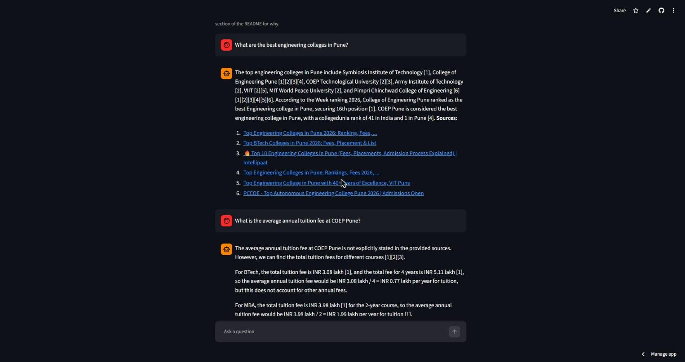
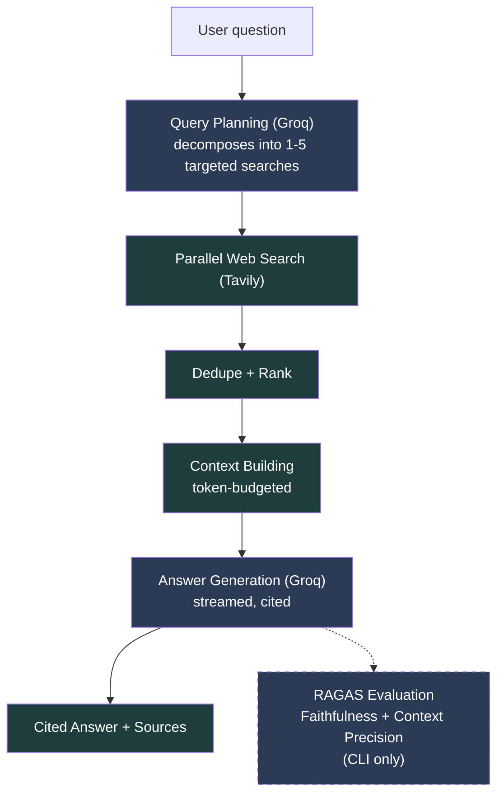

# AI Search Chatbot

An interactive research chatbot: dynamic query planning → parallel Tavily
search → dedup/rank → grounded Groq answer → RAGAS evaluation. Clean,
dependency-inverted architecture throughout, with non-obvious design
decisions verified empirically rather than assumed.

## Live Demo

**[ai-chatbot-search.streamlit.app](https://ai-chatbot-search.streamlit.app/)**



A public Streamlit chat UI over the same `ChatPipeline` the CLI uses - no
pipeline logic duplicated between them. The public demo intentionally skips
RAGAS scoring to protect a shared free-tier quota on a public-facing surface
- see [Evaluation](#evaluation) below for where the real scores are still
available.

Run it locally:

```bash
pip install -e ".[demo]"
streamlit run src/presentation/streamlit_app.py
```

## How It Works



Inner layers depend on nothing outward: **`domain/`** (entities +
interfaces, no I/O) ← **`application/`** (orchestration against those
interfaces only) ← **`infrastructure/`** (Tavily/Groq/RAGAS adapters) ←
**`presentation/`** (CLI + Streamlit, both thin adapters over one
`ChatPipeline`). Full pipeline diagram and component responsibilities:
[`docs/architecture.md`](docs/architecture.md).

## Engineering Highlights

- **Dependency-inverted, swappable at every seam** - every external
  integration (search, LLM, evaluation, cache, content extraction) sits
  behind a domain-owned interface; `application/` code depends only on
  those abstractions, never on Tavily/Groq/RAGAS directly. Proven, not just
  aspirational: the public demo swaps in a `NullEvaluator` for the CLI's
  real `RagasEvaluator` via a one-line composition-root change, with zero
  changes to `ChatPipeline` or `EvaluationService`.
- **Evaluation-driven, not just eyeballed** - every CLI turn is scored live
  by RAGAS (Faithfulness, Context Precision) against the actual retrieved
  context, not the model's own citations, closing the loop from "the answer
  looks plausible" to "the answer is measurably grounded."
- **Resilience engineered from real failure modes** - a typed exception per
  external boundary, retry-worthy exception sets verified against each
  SDK's real source rather than guessed, and a graceful-degradation ladder
  so a single flaky Tavily/Groq call degrades one turn instead of crashing
  the process.
- **Concurrency and cost control built in** - sub-queries fan out
  concurrently via `asyncio.gather`, two independently-TTL'd caches (query
  plans, search results) avoid redundant Groq/Tavily calls, and context
  building enforces a token budget before every generation call.
- **Verify-before-build discipline** - non-obvious external behavior was
  reproduced empirically before being designed around, not assumed: an
  async-client/event-loop-reuse crash unique to Streamlit's rerun model,
  Streamlit's own import-path behavior, a provider's actual retryable-error
  set, a hosting platform's real pricing terms. Each is logged as a dated
  decision in [`docs/decisions.md`](docs/decisions.md), not left as tribal
  knowledge.

## Evaluation

RAGAS (reference-free, LLM-judged) scoring is a real, load-bearing part
of this project - it's just not run on every request the public demo
serves. It's available through the CLI/evaluation pipeline
(`ChatPipeline` → `EvaluationService` → `RagasEvaluator`), which every
`python -m src.presentation.cli` turn runs automatically.

Two metrics are wired (a third, `answer_relevancy`, is deliberately
unimplemented - see [Decision 8.x](docs/decisions.md), Groq doesn't serve
an embeddings model):

- **Faithfulness** - how well the generated answer is supported by the
  retrieved source content, i.e. whether the answer is actually grounded
  in what was searched rather than the model's own unsupported claims.
- **Context Precision** - how much of the retrieved source content
  presented to the model was actually relevant to answering the question,
  i.e. whether context-building surfaced good sources rather than noise.

**Why the public demo skips it:** RAGAS makes several extra LLM-judge
calls per answer on top of the ones already needed to plan and generate
it - on a public-facing demo running on Groq's free tier, that's extra
latency per request and a real risk of exhausting the shared rate/quota
limit for every visitor, not just the person who triggered it (see
[Decision 12.2](docs/decisions.md) for the free-tier constraints this
already ran into during development). `build_demo_pipeline()` wires a
`NullEvaluator` instead of `RagasEvaluator` for exactly this reason - see
[Decision 14.2](docs/decisions.md).

**Live-verified**, not just unit-tested in isolation: a real CLI run
against real Tavily + Groq + RAGAS returned actual scores end-to-end,
after `evaluation_timeout_seconds` was raised from 15s to 30s
([Decision 12.2](docs/decisions.md)) to fit a real successful RAGAS
call's own measured ~14.5s runtime. This is a verified integration
result observed on one real run, not a benchmark and not a guaranteed
score on future runs - Faithfulness/Context Precision depend on the
specific question, sources found, and the judge model's own output that
run.

```
> What is the capital of Japan?
The capital of Japan is Tokyo [1][3][4]. However, it's worth noting that
Tokyo is not officially or legally designated as the capital of Japan
[2][4], but it is widely accepted as the capital by the people and the
government [4].

Sources:
  [1] What is the capital of Japan?  | Britannica - https://www.britannica.com/question/What-is-the-capital-of-Japan
  [2] Medium - https://medium.com/yamashita-guild/why-tokyo-isnt-legally-the-capital-of-japan-yes-really-630451315ff2
  [3] Tokyo, Japan - https://clintonwhitehouse3.archives.gov/WH/New/Pacific/tokyo.html
  [4] Capital of Japan - Wikipedia - https://en.wikipedia.org/wiki/Capital_of_Japan

(scores: faithfulness=1.00, context_precision=1.00)
```
*Example live RAGAS evaluation run (real CLI output, log lines omitted
per the quiet-by-default terminal - Decision 13.3). One observed run;
scores are not fixed or guaranteed on future runs.*

## Setup

```bash
python -m venv venv
source venv/Scripts/activate    # Windows Git Bash; use venv\Scripts\activate.bat on cmd
pip install -e ".[dev]"
pip install --no-deps ragas==0.4.3
cp .env.example .env            # then fill in TAVILY_API_KEY and GROQ_API_KEY
```

`ragas` needs the extra `--no-deps` step because its normal install pulls
in `scikit-network` (a C-extension graph library with no Windows wheel,
needed only for a synthetic-testset-generation feature this project
doesn't use) - see [Decision 8.1](docs/decisions.md) for the full
investigation. Every other real dependency `ragas` needs is already
listed normally above.

## Running the CLI

```bash
python -m src.presentation.cli
```

Interactive terminal chat: ask a question, watch the answer stream in
token-by-token, then see its sources and RAGAS scores. Ctrl-C or Ctrl-D
(EOF) exits cleanly. By default the terminal shows only the conversation -
no dev logs, no HTTP request noise.

For debugging, set `LOG_LEVEL=INFO` in `.env` to restore structured logs
(per-turn correlation IDs, and one `turn timings:` summary line per turn
breaking down planning/search/context/generation/eval durations). They go
to stderr, kept separate from the streamed answer text on stdout, so you
can redirect just the logs: `python -m src.presentation.cli 2>chat.log`.

## Testing

```bash
python -m pytest tests/unit                                    # unit tests (mocked providers)
python -m pytest tests/unit --cov=src --cov-report=term-missing # + coverage report
RUN_INTEGRATION_TESTS=1 python -m pytest tests/integration/      # real Tavily/Groq/RAGAS calls
```

Unit tests never touch the network. Integration tests are skipped unless
`RUN_INTEGRATION_TESTS=1` is set, since they spend real Tavily/Groq quota.

## Project Structure

<details>
<summary>Full source tree</summary>

```
src/
├── bootstrap.py           # composition root: Settings -> real instances -> one ChatPipeline
├── domain/
│   ├── entities.py       # Query, SearchResult, Source, Answer, EvaluationResult
│   ├── interfaces.py     # SearchProvider, LLMProvider, Ranker, Evaluator, ContentExtractor, Cache
│   └── exceptions.py     # PipelineError + SearchProviderError, LLMGenerationError, EvaluationError
├── application/
│   ├── search_orchestrator.py  # concurrent fan-out over a SearchProvider, per-query timeout
│   ├── deduplicator.py         # URL normalization + near-duplicate content passes
│   ├── ranker.py               # HeuristicRanker: weighted provider/keyword/recency scoring
│   ├── context_builder.py      # top-K selection, thin-snippet full-fetch, token-budget enforcement
│   ├── query_planner.py        # Groq structured-output call -> Query, with single-query fallback
│   ├── answer_generator.py     # Groq generate()/generate_streaming() -> cited Answer; failures propagate to ChatPipeline
│   ├── pipeline.py             # ChatPipeline: chains query planning through evaluation; handle() + handle_streaming(), always returns Answer
│   └── evaluation_service.py   # non-blocking Evaluator wrapper: timeout + catch, always returns EvaluationResult
├── infrastructure/
│   ├── search/
│   │   └── tavily_provider.py  # implements SearchProvider via Tavily's async client; retries + SearchProviderError + URL filter
│   ├── llm/
│   │   └── groq_client.py      # implements LLMProvider (generate + generate_structured + generate_stream); retries + LLMGenerationError
│   ├── evaluation/
│   │   ├── ragas_evaluator.py  # implements Evaluator via RAGAS + instructor + Groq; wraps failures as EvaluationError
│   │   └── null_evaluator.py   # no-op Evaluator: instant EvaluationResult(), no I/O - used by the public demo
│   ├── cache/
│   │   └── memory_cache.py     # InMemoryCache: dict + lazy TTL expiry, implements Cache
│   └── content/
│       └── content_extractor.py  # TrafilaturaContentExtractor implements ContentExtractor
├── config/
│   ├── settings.py       # pydantic-settings, validated env config
│   └── prompts/
│       ├── query_planner.txt       # system prompt text, plain text, not Python
│       ├── query_planning.py       # loads the .txt + QueryPlanResponse schema
│       ├── answer_generation.txt   # cite-or-refuse system prompt, plain text
│       └── answer_generation.py    # loads the .txt (no schema - free text, not structured)
├── presentation/
│   ├── cli.py             # interactive chat loop: streams answers, prints sources + RAGAS scores, `python -m src.presentation.cli`
│   └── streamlit_app.py   # public demo chat UI: streams answers + sources, skips RAGAS (NullEvaluator), `streamlit run src/presentation/streamlit_app.py`
└── utils/
    ├── logging.py        # structured logging with per-turn correlation IDs
    └── token_counter.py  # approximate token counting (char-based heuristic)

tests/
├── unit/
│   ├── test_settings.py
│   ├── test_logging.py
│   ├── test_entities.py
│   ├── test_interfaces.py
│   ├── test_tavily_provider.py
│   ├── test_search_orchestrator.py
│   ├── test_deduplicator.py
│   ├── test_ranker.py
│   ├── test_token_counter.py
│   ├── test_content_extractor.py
│   ├── test_context_builder.py
│   ├── test_groq_client.py
│   ├── test_query_planner.py
│   ├── test_answer_generator.py
│   ├── test_pipeline.py          # full chain, real everywhere except SearchProvider/LLMProvider/Evaluator
│   ├── test_bootstrap.py
│   ├── test_ragas_evaluator.py
│   ├── test_null_evaluator.py
│   ├── test_evaluation_service.py
│   └── test_memory_cache.py
└── integration/
    ├── test_tavily_search.py     # real Tavily call, gated behind RUN_INTEGRATION_TESTS=1
    ├── test_query_planner.py     # real Groq call, gated behind RUN_INTEGRATION_TESTS=1
    ├── test_answer_generator.py    # incl. generate_streaming()/StreamedAnswer  # real Groq call, gated behind RUN_INTEGRATION_TESTS=1
    ├── test_ragas_evaluator.py   # real Groq call via RAGAS, gated behind RUN_INTEGRATION_TESTS=1
    └── test_pipeline.py          # full real end-to-end run (incl. evaluation), gated behind RUN_INTEGRATION_TESTS=1
```

</details>

## Documentation

**Status:** Phases 0-14 complete - the full pipeline (plan → search →
dedup → rank → context → generate → evaluate) runs as one real, cached,
resilient, end-to-end call, plus a public live demo. See
[`docs/roadmap.md`](docs/roadmap.md) for the phase-by-phase checklist.

Full architecture, design decisions, and the phased roadmap live in
[`docs/`](docs/) - see [`docs/architecture.md`](docs/architecture.md),
[`docs/decisions.md`](docs/decisions.md), and
[`docs/roadmap.md`](docs/roadmap.md). Build notes for each completed phase
are in [`docs/phases/`](docs/phases/); a session-by-session dev journal is
in [`DEVLOG.md`](DEVLOG.md).

An earlier learning prototype (LangChain `create_agent` + Tavily + Gemini)
is preserved as-is in
[`archive/module7-learning-search-agent/`](archive/module7-learning-search-agent/)
for reference; it is not part of the active codebase.
