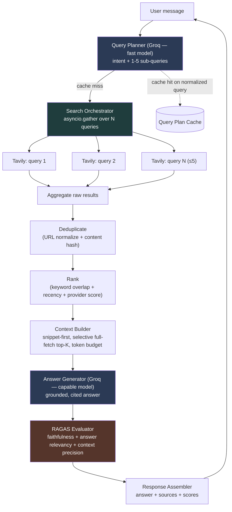

# AI Search Chatbot — System Architecture

**Provider:** Tavily (search) · Groq (LLM) · RAGAS (evaluation)
**Interface:** CLI first, FastAPI later
**Status:** Design phase — no implementation yet

---

## 1. Objective, restated as an engineering problem

A user asks a natural-language research question. The system must turn that into
1–5 targeted search queries, run them concurrently against a single search
provider, merge and rank what comes back, compress it into a small grounded
context, ask Groq to answer *only* from that context, score the answer with
RAGAS, and return the answer plus its sources. Every stage is a swappable
component behind an interface, because the internship deliverable is judged as
much on architecture as on the demo.

Two competing pressures shape every decision below: **accuracy** (ground the
answer, avoid hallucination) vs. **latency/tokens** (this is an interactive
chatbot — a 15-second wait per turn kills the "interactive" claim in the
brief). Where a design decision trades one for the other, that tradeoff is
called out explicitly.

---

## 2. End-to-end pipeline



Two Groq calls per turn (planner, generator), one Tavily fan-out, one RAGAS
pass (itself 1–3 Groq calls as judge). That's the entire cost surface — every
optimization section below is about shrinking or parallelizing those calls.

---

## 3. Clean-architecture layering

The brief asks for SOLID + loose coupling, so the codebase is organized by
**dependency direction**, not by feature. Inner layers never import outer
layers.

| Layer | Contains | Depends on |
|---|---|---|
| **Domain** | Entities (`Query`, `SearchResult`, `Source`, `Answer`, `EvaluationResult`) and interfaces/ports (`SearchProvider`, `LLMProvider`, `Ranker`, `Evaluator`, `Cache`) | Nothing |
| **Application** | Use-case orchestration: `QueryPlanner`, `SearchOrchestrator`, `Deduplicator`, `Ranker` impl, `ContextBuilder`, `AnswerGenerator`, `EvaluationService`, `ChatPipeline` | Domain only (interfaces, not concrete classes) |
| **Infrastructure** | Concrete adapters: `TavilyProvider`, `GroqClient`, `RagasEvaluator`, `InMemoryCache`/`RedisCache`, `ContentExtractor` | Domain (implements the ports) |
| **Presentation** | `cli.py` (chat loop), later `api.py` (FastAPI) | Application |

This is why Serper can later replace Tavily by adding one file and one config
line — nothing in `application/` or `presentation/` ever imports
`infrastructure.search.tavily_provider` directly; it depends on the
`SearchProvider` abstract class and receives a concrete instance via
constructor injection from a small composition root (`bootstrap.py`).

---

## 4. Folder structure

```
ai-search-chatbot/
├── src/
│   ├── domain/
│   │   ├── entities.py              # Query, SearchResult, Source, Answer, EvaluationResult
│   │   └── interfaces.py            # SearchProvider, LLMProvider, Ranker, Evaluator, Cache (ABCs)
│   │
│   ├── application/
│   │   ├── query_planner.py         # decides intent + generates 1-5 queries
│   │   ├── search_orchestrator.py   # parallel fan-out over SearchProvider
│   │   ├── deduplicator.py
│   │   ├── ranker.py                # default heuristic implementation of Ranker
│   │   ├── context_builder.py       # snippet-first + token budgeting
│   │   ├── answer_generator.py      # grounded prompt -> Groq -> Answer
│   │   ├── evaluation_service.py    # wraps RAGAS
│   │   └── pipeline.py              # ChatPipeline: wires the above into one call
│   │
│   ├── infrastructure/
│   │   ├── search/
│   │   │   └── tavily_provider.py   # implements SearchProvider (Serper impl added later, same file shape)
│   │   ├── llm/
│   │   │   └── groq_client.py       # implements LLMProvider, model-tiered
│   │   ├── evaluation/
│   │   │   └── ragas_evaluator.py   # implements Evaluator
│   │   ├── cache/
│   │   │   ├── memory_cache.py      # dev default
│   │   │   └── redis_cache.py       # production option
│   │   └── content/
│   │       └── content_extractor.py # trafilatura-based full-page fetch, used selectively
│   │
│   ├── config/
│   │   ├── settings.py              # pydantic-settings, reads .env
│   │   └── prompts/
│   │       ├── query_planning.py
│   │       └── answer_generation.py
│   │
│   ├── presentation/
│   │   ├── cli.py                   # Phase 1 interactive chat loop
│   │   └── api.py                   # Phase 2, FastAPI wrapper (not built yet)
│   │
│   ├── utils/
│   │   ├── logging.py               # structured logging with request/turn IDs
│   │   ├── token_counter.py         # tiktoken-based budget helper
│   │   └── retry.py                 # tenacity wrappers for external calls
│   │
│   └── bootstrap.py                 # composition root: reads settings, builds ChatPipeline
│
├── tests/
│   ├── unit/                        # one test module per application/ file, providers mocked
│   └── integration/                 # real Tavily/Groq calls, gated behind env flag
│
├── .env.example
├── pyproject.toml
└── README.md
```

---

## 5. Component responsibilities and why each exists

| Component | Responsibility | Why it's a separate component |
|---|---|---|
| **QueryPlanner** | Single Groq call: classify intent + emit 1–5 sub-queries as structured JSON | Isolates the only place that decides "how many searches." Swapping the decomposition strategy (e.g., adding few-shot examples, a different model) never touches search or ranking code. |
| **SearchOrchestrator** | Fans sub-queries out concurrently to one `SearchProvider`, applies per-query timeout, tolerates partial failure | Concurrency and resilience logic lives once, not duplicated per provider. |
| **SearchProvider (port)** | `async def search(query, max_results) -> list[SearchResult]` | The one interface constraint #4 demands. Tavily today, Serper (or both, fanned out) later — zero changes above this line. |
| **Deduplicator** | Removes same-URL and near-duplicate-content results across all sub-query result sets | Sub-queries *will* overlap ("best CE colleges Pune" + "top engineering colleges Pune ranking" return the same JEE-counsellor articles) — without this step the ranker sees inflated relevance for duplicated domains. |
| **Ranker (port + default impl)** | Scores and orders the deduplicated set | Kept behind an interface so a heuristic scorer today can become an embedding/cross-encoder reranker later without touching the pipeline. |
| **ContextBuilder** | Picks top-K sources, decides snippet-vs-full-content per source, enforces a token budget | This is the accuracy/token tradeoff's home. One component owns "how much do we show the LLM," so token limits are tuned in one place. |
| **ContentExtractor** | Fetches and cleans full page HTML for the (few) sources where snippet is judged insufficient | Kept separate from ContextBuilder so it can be skipped, cached, or swapped (readability vs. trafilatura) independently. |
| **AnswerGenerator** | Builds the grounded prompt, calls Groq's capable model, parses citations | The only component allowed to produce user-facing prose — keeps grounding rules (cite-or-refuse) enforced in exactly one prompt. |
| **EvaluationService** | Wraps RAGAS metrics against (question, answer, contexts) | Isolated because RAGAS has its own LLM-judge cost and failure modes; it must never be able to block or corrupt answer delivery. |
| **ChatPipeline** | Orchestrates the above in order, owns cross-cutting concerns (timing, logging, error fallbacks) | The single "use case" object — this is what `presentation/cli.py` and later `api.py` both call, so CLI and API never duplicate orchestration logic. |
| **Cache (port)** | Get/set with TTL | Memory for dev, Redis for prod, behind one interface so `pipeline.py` never knows which. |

---

## 6. Key design decisions

**6.1 One combined Groq call for intent + query generation, not two.**
Classifying intent and generating queries are related enough that a single
structured-output call (JSON mode with a schema: `{intent, complexity,
queries: [...]}`) does both for the token/latency cost of one call. Splitting
them into "classify, then plan" would double planning latency for no accuracy
gain at this scope.

**6.2 Query count is LLM-decided, not rule-based.**
A regex/keyword heuristic for "complexity" (e.g., counting clauses) is
brittle and doesn't generalize. Instead the planner prompt gives the model
explicit criteria (single fact → 1 query; comparison/ranking/multi-attribute
→ 3–5) and the model returns the count directly, capped at 5 by the response
schema (`maxItems: 5`) as a hard backstop.

**6.3 Snippet-first context, selective full-fetch — not one or the other.**
Tavily snippets are usually enough for factual grounding and cost near-zero
extra latency. But for the top 2–3 ranked sources, if the snippet is short
(< ~40 words) or the query is comparison-heavy, the ContextBuilder fetches
and extracts the actual page. This directly answers constraint #9 ("choose
whichever improves accuracy") without paying full-page-fetch latency on every
source.

**6.4 Heuristic ranking now, embedding rerank later — behind one interface.**
An embedding/cross-encoder reranker would improve relevance ordering but adds
a model dependency, latency, and (if using a hosted embedding API) cost and
another external failure point. For an internship-scope MVP, a transparent
heuristic (keyword/TF-IDF overlap with the *original* query + recency +
provider score) is explainable, has zero extra latency, and is correct
often enough. Because `Ranker` is a port, upgrading to embeddings later is a
one-file change — call this out explicitly in the internship writeup as a
deliberate MVP-vs-ideal tradeoff, not an oversight.

**6.5 Model tiering on Groq.**
Query planning uses a small/fast Groq model (e.g. `llama-3.1-8b-instant`);
final answer generation uses a larger model (e.g. `llama-3.3-70b-versatile`).
Planning is a short structured-output task where the small model is reliable;
answer quality is what the user actually judges, so it gets the bigger model.
This alone is one of the larger latency/cost wins available (the planning
call is 3-5x cheaper and faster than the generation call).

**6.6 RAGAS runs reference-free, synchronously, but non-blocking on failure.**
Because there's no ground-truth answer at chat time, only reference-free
RAGAS metrics apply: **faithfulness** (is the answer supported by the
retrieved context — the most important one for a grounded chatbot),
**answer relevancy** (does the answer address the question), and **context
precision** (is the retrieved context actually useful). `context_recall`
needs a reference answer and is deliberately left for an *offline* eval
harness (a curated test set), not the live path. RAGAS calls run after
generation (they need the answer) but its 2–3 metric computations run
concurrently via `asyncio.gather`. If RAGAS itself errors or times out, the
pipeline still returns the answer with `evaluation: null` rather than failing
the user-facing turn — evaluation is an observability feature, not a gate the
user should ever be blocked on.

**6.7 CLI first.**
Validates the pipeline end-to-end fastest. `ChatPipeline` is presentation-
agnostic by construction, so `api.py` is additive later, not a rewrite.

---

## 7. Tradeoffs summary

| Decision | Gains | Costs | Mitigation |
|---|---|---|---|
| Single search provider | Simpler, meets constraint, cheaper | Coverage limited to one index | Interface allows swap/fan-out later |
| Snippet-first, selective fetch | Fast, cheap | Occasionally thinner context than full pages | Full-fetch triggers for top-K + short snippets |
| Heuristic ranking (no embeddings) | No extra model/latency/cost | Lower ranking precision than semantic rerank | Ranker port makes upgrade a one-file change |
| Sync RAGAS in the request path | User sees eval score immediately (per spec) | Adds real latency (RAGAS = more LLM calls) | Parallelize metrics; fail-open (don't block answer) |
| LLM-decided query count | Generalizes better than rules | Occasional over/under-generation | Hard cap at 5 in schema; min 1 enforced by validation |
| In-memory cache by default | Zero infra to start | Doesn't survive restarts, not multi-instance | `Cache` port swaps to Redis with one config change |

---

## 8. Performance optimizations

- **Parallel search fan-out** — all sub-queries hit Tavily concurrently via `asyncio.gather`, not sequentially.
- **Model tiering** — small/fast model for planning, larger model only for the user-facing answer.
- **Streaming the final answer** — Groq supports token streaming; the CLI (and later API via SSE) should stream the answer as it's generated rather than waiting for the full completion, so perceived latency drops even though total tokens/time is unchanged.
- **Reused async HTTP clients** — one `httpx.AsyncClient` per external service (Tavily, Groq) constructed once at bootstrap and reused, not recreated per request (avoids TCP/TLS handshake cost per call).
- **Short-circuit for simple queries** — if the planner returns exactly 1 query with high confidence, skip the heavier multi-source dedup/rank path (still runs, but on a trivially small set) rather than adding artificial work.
- **Selective full-page fetch** — only top-K sources with thin snippets get fetched; this is the single biggest avoidable latency cost in naive RAG pipelines, so it's opt-in per source, not global.
- **Concurrent RAGAS metrics** — faithfulness / answer relevancy / context precision computed in parallel, not sequentially.

## 9. Token optimization strategies

- **Small model for planning** — the planning prompt + schema is short and doesn't need a 70B model.
- **Hard context token budget** — `ContextBuilder` enforces a fixed budget (e.g. 2,500 tokens) for retrieved context, allocated across sources weighted by rank, truncating lower-ranked snippets first.
- **Dedup before context building** — removing near-duplicate sources means the token budget isn't spent twice on the same fact from two URLs.
- **Snippets over full pages by default** — a snippet is ~30–60 tokens; a full page can be 1,000+. Full-fetch is the exception, gated by the thin-snippet rule (6.3).
- **Citation-by-index, not by URL, in the generation prompt** — sources are labeled `[1]`, `[2]`... in the prompt and the model cites indices; full URLs are attached in the response assembler, not repeated in every prompt token.
- **No chat-history replay into search/planning by default** — for a single-turn research question this doesn't matter; noted here because it becomes relevant the moment multi-turn is added (see §12) — history should be summarized, not replayed verbatim, to avoid linear token growth per turn.

## 10. Parallel execution strategy

Three distinct concurrency points, each using the right primitive:

1. **Search fan-out** — `asyncio.gather(*[provider.search(q) for q in queries], return_exceptions=True)`. `return_exceptions=True` is deliberate: one failed sub-query must not fail the whole turn.
2. **Content extraction** — fetching/parsing the (few) full pages for thin-snippet sources is I/O + light CPU; run via `asyncio.gather` over async fetches, with parsing (trafilatura) offloaded to a thread pool (`asyncio.to_thread`) since HTML parsing is blocking CPU work.
3. **RAGAS metrics** — the 2–3 reference-free metrics are independent given (question, answer, contexts) and are gathered concurrently rather than computed in RAGAS's default sequential batch mode where avoidable.

Per-call timeouts wrap all three (`asyncio.wait_for`), because an interactive chatbot must never let one slow provider call stall the whole turn indefinitely.

## 11. Error handling strategy

- **Retry with backoff** (via `tenacity`) on transient failures from Tavily and Groq — network errors, 429/5xx — with a small max-attempt count (2–3) so retries don't themselves become the latency problem.
- **Per-stage timeout budgets** — search, generation, and evaluation each get their own timeout; a stage that exceeds it fails independently rather than hanging the turn.
- **Graceful degradation ladder**, not all-or-nothing failure:
  - Some sub-queries fail → proceed with whatever results returned (as long as ≥1 succeeded).
  - All search fails → tell the user search is unavailable rather than silently answering ungrounded (never let Groq quietly answer from parametric memory and present it as sourced).
  - RAGAS fails or times out → return the answer with `evaluation: null` + a logged warning, never block the answer on it.
  - Groq generation fails after retries → surface a clear "couldn't generate an answer, please retry" rather than a stack trace.
- **Typed exceptions per layer** (`SearchProviderError`, `LLMGenerationError`, `EvaluationError`) caught at the `ChatPipeline` boundary, logged with a per-turn correlation ID, translated into a single well-shaped error response for the presentation layer.
- **Input validation at the boundary** — empty/absurdly long user input rejected before it reaches the planner, not after burning an LLM call.

## 12. Caching opportunities

| Cache | Key | TTL | Value |
|---|---|---|---|
| Query plan cache | Normalized user query (lowercased, whitespace-collapsed) | Short (e.g. 10 min) | Same question asked twice in a session skips a planning LLM call entirely |
| Search result cache | Individual sub-query string | Medium (e.g. 1 hr) | Different users/turns generating an overlapping sub-query (very common — "best X in Pune" style queries repeat sub-query phrasing) reuse Tavily results, saving both latency and API quota |
| Final answer cache | Hash of (query + context source set) | Optional, short TTL | Risk of staleness for time-sensitive queries — only worth adding if demo shows repeat questions matter |

Start with `InMemoryCache` (simple dict + TTL, fine for a single-process CLI
demo); the `Cache` port means swapping in Redis for a multi-instance API
deployment later is a bootstrap-level config change, not a code change
anywhere else.

## 13. Future scalability ideas

- **Multi-provider fan-out** — a `CompositeSearchProvider` implementing the same `SearchProvider` interface that queries Tavily + Serper together and merges results, with zero changes to anything above it.
- **Semantic cache** — embed incoming queries and check a vector store for near-duplicate past queries before re-planning/re-searching, catching paraphrases that exact-string caching misses.
- **Multi-turn conversation memory** — summarized rolling history feeding the planner, so follow-up questions ("what about Mumbai instead?") inherit context without replaying full transcripts.
- **Embedding/cross-encoder reranker** — drop-in replacement for the heuristic `Ranker` once accuracy needs outgrow it.
- **Streaming end-to-end over SSE/WebSocket** once the FastAPI layer exists.
- **Observability** — structured tracing per turn (OpenTelemetry or a lighter LLM-specific tracer) covering per-stage latency and token counts, feeding a dashboard — valuable for an internship demo that shows *why* the system is fast, not just that it works.
- **Offline eval harness** — a curated (question, reference answer) set run through RAGAS's full metric suite including `context_recall`, run in CI, separate from the live reference-free path.
- **Auth + rate limiting** once exposed as an API beyond local/demo use.

---

## 14. Phased implementation roadmap

Each phase produces something runnable/testable before moving on — no phase depends on an unbuilt future phase.

**Phase 0 — Project scaffolding**
Repo structure, `pyproject.toml`, dependency setup, `.env.example`, settings loader, logging setup.

**Phase 1 — Domain layer**
Entities and interfaces only. No implementations. This is the contract everything else is built against.

**Phase 2 — Search integration**
`TavilyProvider` implementing `SearchProvider`. `SearchOrchestrator` with parallel fan-out, timeouts, partial-failure tolerance. Testable standalone: give it a hardcoded list of queries, get back merged raw results.

**Phase 3 — Dedup + ranking**
`Deduplicator` and default `Ranker`. Testable standalone against fixture search results.

**Phase 4 — Context building**
`ContextBuilder` with token budgeting and the snippet-vs-full-fetch rule; `ContentExtractor` for the full-fetch path.

**Phase 5 — Query planning**
`QueryPlanner` calling Groq's fast model with structured output, schema validation, capped at 5 queries.

**Phase 6 — Answer generation**
`AnswerGenerator` calling Groq's capable model with the grounded/cited prompt.

**Phase 7 — Pipeline wiring**
`ChatPipeline` composes phases 2–6 into one call. First true end-to-end run, still without evaluation.

**Phase 8 — RAGAS evaluation**
`EvaluationService` wrapping faithfulness/answer relevancy/context precision, wired into the pipeline as a non-blocking final step.

**Phase 9 — Caching**
`InMemoryCache`, wired into query planning and search stages.

**Phase 10 — Resilience hardening**
Retries, per-stage timeouts, typed exceptions, graceful degradation paths from §11.

**Phase 11 — CLI presentation layer**
Interactive terminal chat loop calling `ChatPipeline`, with streamed answer output.

**Phase 12 — Testing**
Unit tests per application-layer component (providers mocked), integration tests gated behind an env flag for real Tavily/Groq calls.

**Phase 13 — Observability & polish**
Structured per-turn logging/timing, README, architecture doc finalization for the internship writeup.

**Phase 14 — Optional: FastAPI layer**
`api.py` wrapping the same `ChatPipeline`, only after everything above is solid.

---

## 15. Task checklist

Each box is independently completable and independently testable.

### Phase 0 — Scaffolding
- [ ] Initialize repo, `pyproject.toml`, dependency groups (runtime vs dev/test)
- [ ] Create folder structure from §4 (empty `__init__.py` files)
- [ ] `.env.example` with `TAVILY_API_KEY`, `GROQ_API_KEY`
- [ ] `config/settings.py` using `pydantic-settings` to load and validate env vars
- [ ] `utils/logging.py` — structured logger with per-turn correlation ID support

### Phase 1 — Domain layer
- [ ] `domain/entities.py`: `Query`, `SearchResult`, `Source`, `Answer`, `EvaluationResult` dataclasses
- [ ] `domain/interfaces.py`: `SearchProvider` ABC (`async search(query, max_results) -> list[SearchResult]`)
- [ ] `domain/interfaces.py`: `LLMProvider` ABC (`async generate(prompt, **kwargs) -> str`, plus a structured-output variant)
- [ ] `domain/interfaces.py`: `Ranker` ABC (`rank(results, original_query) -> list[SearchResult]`)
- [ ] `domain/interfaces.py`: `Evaluator` ABC (`async evaluate(question, answer, contexts) -> EvaluationResult`)
- [ ] `domain/interfaces.py`: `Cache` ABC (`get`, `set` with TTL)

### Phase 2 — Search integration
- [ ] `infrastructure/search/tavily_provider.py`: implement `SearchProvider` using Tavily's async client
- [ ] Map Tavily's raw response into `SearchResult` entities
- [ ] `application/search_orchestrator.py`: `asyncio.gather` fan-out with `return_exceptions=True`
- [ ] Add per-query timeout (`asyncio.wait_for`) inside the orchestrator
- [ ] Unit test: orchestrator with a mocked `SearchProvider` that fails on one of three queries — assert partial results returned
- [ ] Integration test (env-gated): one real Tavily call end-to-end

### Phase 3 — Dedup + ranking
- [ ] `application/deduplicator.py`: URL normalization (strip query params/fragments) pass
- [ ] `application/deduplicator.py`: near-duplicate content pass (title+snippet similarity)
- [ ] `application/ranker.py`: keyword-overlap scoring against original query
- [ ] `application/ranker.py`: combine with recency + provider score into final rank
- [ ] Unit tests with fixture result sets containing intentional duplicates

### Phase 4 — Context building
- [ ] `utils/token_counter.py`: token counting helper (tiktoken or model-appropriate tokenizer)
- [ ] `application/context_builder.py`: top-K selection from ranked results
- [ ] `application/context_builder.py`: thin-snippet detection rule triggering full-fetch
- [ ] `infrastructure/content/content_extractor.py`: fetch + extract main content (trafilatura), thread-offloaded
- [ ] `application/context_builder.py`: token-budget enforcement with per-source truncation
- [ ] Unit tests: budget enforcement never exceeds the configured cap

### Phase 5 — Query planning
- [ ] `config/prompts/query_planning.py`: prompt + JSON schema (intent, complexity, queries[1..5])
- [ ] `infrastructure/llm/groq_client.py`: structured-output call method using the fast model
- [ ] `application/query_planner.py`: call + schema validation + hard cap/floor enforcement (1–5)
- [ ] Fallback path: on planner failure, fall back to a single query = raw user input
- [ ] Unit tests: mocked Groq responses covering valid, malformed, and over-5-queries cases

### Phase 6 — Answer generation
- [ ] `config/prompts/answer_generation.py`: grounded/cite-or-refuse system prompt
- [ ] `infrastructure/llm/groq_client.py`: generation method using the capable model, streaming-capable
- [ ] `application/answer_generator.py`: build indexed source list, call Groq, parse citation markers into `Answer`
- [ ] Unit tests: mocked Groq output with citations mapped back to correct `Source` objects

### Phase 7 — Pipeline wiring
- [ ] `application/pipeline.py`: `ChatPipeline.handle(user_query) -> Answer` composing phases 2–6
- [ ] `bootstrap.py`: composition root wiring concrete providers from settings into `ChatPipeline`
- [ ] Manual end-to-end smoke test with a real question

### Phase 8 — RAGAS evaluation
- [ ] `infrastructure/evaluation/ragas_evaluator.py`: implement `Evaluator`, wrap RAGAS with Groq as judge LLM
- [ ] Wire faithfulness, answer_relevancy, context_precision as concurrent metric calls
- [ ] `application/evaluation_service.py`: non-blocking wrapper — catches evaluator errors, returns `None` on failure
- [ ] Wire into `ChatPipeline` as the final step
- [ ] Unit test: evaluator failure does not propagate to pipeline failure

### Phase 9 — Caching
- [ ] `infrastructure/cache/memory_cache.py`: TTL dict-based `Cache` implementation
- [ ] Wire query-plan caching into `QueryPlanner`
- [ ] Wire per-sub-query result caching into `SearchOrchestrator`
- [ ] Unit tests: cache hit skips the underlying call (assert mock not called twice)

### Phase 10 — Resilience hardening
- [ ] Add `tenacity` retry decorators to Tavily and Groq client calls
- [ ] Define typed exceptions: `SearchProviderError`, `LLMGenerationError`, `EvaluationError`
- [ ] Catch and translate exceptions at `ChatPipeline` boundary into a single response shape
- [ ] Implement the degradation ladder from §11 (all-search-failed path, generation-failed path)
- [ ] Input validation at pipeline entry (empty/oversized query rejection)

### Phase 11 — CLI presentation
- [ ] `presentation/cli.py`: interactive loop reading stdin, calling `ChatPipeline`
- [ ] Stream answer tokens to stdout as they arrive
- [ ] Print sources and RAGAS scores after the answer
- [ ] Handle Ctrl-C / empty input gracefully

### Phase 12 — Testing
- [ ] Unit test coverage for every `application/` module (providers/LLM mocked)
- [ ] Integration test suite behind `RUN_INTEGRATION_TESTS=1` env flag
- [ ] At least one full end-to-end integration test with real Tavily + Groq

### Phase 13 — Observability & polish
- [ ] Per-stage timing captured and logged per turn (planning/search/context/generation/eval durations)
- [ ] README: setup instructions, architecture summary, how to run
- [ ] Finalize this architecture doc with any deviations made during implementation

### Phase 14 — Optional: FastAPI layer
- [ ] `presentation/api.py`: single `POST /chat` endpoint calling the same `ChatPipeline`
- [ ] Request/response Pydantic models
- [ ] SSE or WebSocket streaming variant (optional stretch)

---

**Next step:** confirm this architecture, then we implement Phase 0 and Phase 1 first — scaffolding and the domain layer — since every later phase depends on those interfaces being right before any concrete code is written against them.
