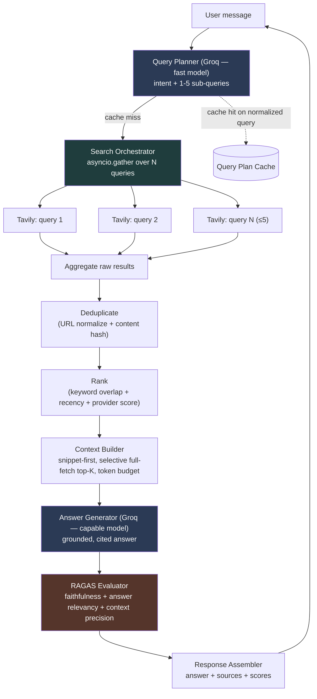

# AI Search Chatbot — Architecture

**Provider:** Tavily (search) · Groq (LLM) · RAGAS (evaluation)
**Interface:** CLI first, FastAPI later

Related docs: [Decisions & tradeoffs](decisions.md) · [Roadmap & checklist](roadmap.md) · [Phase build logs](phases/)

---

## 1. Objective, restated as an engineering problem

A user asks a natural-language research question. The system must turn that into
1–5 targeted search queries, run them concurrently against a single search
provider, merge and rank what comes back, compress it into a small grounded
context, ask Groq to answer *only* from that context, score the answer with
RAGAS, and return the answer plus its sources. Every stage is a swappable
component behind an interface, because the internship deliverable is judged as
much on architecture as on the demo.

Two competing pressures shape every decision in [decisions.md](decisions.md):
**accuracy** (ground the answer, avoid hallucination) vs. **latency/tokens**
(this is an interactive chatbot — a 15-second wait per turn kills the
"interactive" claim in the brief). Where a design decision trades one for the
other, that tradeoff is called out explicitly.

---

## 2. End-to-end pipeline



Two Groq calls per turn (planner, generator), one Tavily fan-out, one RAGAS
pass (itself 1–3 Groq calls as judge). That's the entire cost surface — every
optimization in [decisions.md](decisions.md) is about shrinking or
parallelizing those calls.

---

## 3. Clean-architecture layering

The brief asks for SOLID + loose coupling, so the codebase is organized by
**dependency direction**, not by feature. Inner layers never import outer
layers.

| Layer | Contains | Depends on |
|---|---|---|
| **Domain** | Entities (`Query`, `SearchResult`, `Source`, `Answer`, `EvaluationResult`) and interfaces/ports (`SearchProvider`, `LLMProvider`, `Ranker`, `Evaluator`, `Cache`) | Nothing |
| **Application** | Use-case orchestration: `QueryPlanner`, `SearchOrchestrator`, `Deduplicator`, `Ranker` impl, `ContextBuilder`, `AnswerGenerator`, `EvaluationService`, `ChatPipeline` | Domain only (interfaces, not concrete classes) |
| **Infrastructure** | Concrete adapters: `TavilyProvider`, `GroqClient`, `RagasEvaluator`, `InMemoryCache`/`RedisCache`, `ContentExtractor` | Domain (implements the ports) |
| **Presentation** | `cli.py` (chat loop), later `api.py` (FastAPI) | Application |

This is why Serper can later replace Tavily by adding one file and one config
line — nothing in `application/` or `presentation/` ever imports
`infrastructure.search.tavily_provider` directly; it depends on the
`SearchProvider` abstract class and receives a concrete instance via
constructor injection from a small composition root (`bootstrap.py`).

---

## 4. Folder structure

This is the target design. See the root [README](../README.md#project-structure)
for what's actually implemented so far.

```
ai-search-chatbot/
├── src/
│   ├── domain/
│   │   ├── entities.py              # Query, SearchResult, Source, Answer, EvaluationResult
│   │   └── interfaces.py            # SearchProvider, LLMProvider, Ranker, Evaluator, Cache (ABCs)
│   │
│   ├── application/
│   │   ├── query_planner.py         # decides intent + generates 1-5 queries
│   │   ├── search_orchestrator.py   # parallel fan-out over SearchProvider
│   │   ├── deduplicator.py
│   │   ├── ranker.py                # default heuristic implementation of Ranker
│   │   ├── context_builder.py       # snippet-first + token budgeting
│   │   ├── answer_generator.py      # grounded prompt -> Groq -> Answer
│   │   ├── evaluation_service.py    # wraps RAGAS
│   │   └── pipeline.py              # ChatPipeline: wires the above into one call
│   │
│   ├── infrastructure/
│   │   ├── search/
│   │   │   └── tavily_provider.py   # implements SearchProvider (Serper impl added later, same file shape)
│   │   ├── llm/
│   │   │   └── groq_client.py       # implements LLMProvider, model-tiered
│   │   ├── evaluation/
│   │   │   └── ragas_evaluator.py   # implements Evaluator
│   │   ├── cache/
│   │   │   ├── memory_cache.py      # dev default
│   │   │   └── redis_cache.py       # production option
│   │   └── content/
│   │       └── content_extractor.py # trafilatura-based full-page fetch, used selectively
│   │
│   ├── config/
│   │   ├── settings.py              # pydantic-settings, reads .env
│   │   └── prompts/
│   │       ├── query_planning.py
│   │       └── answer_generation.py
│   │
│   ├── presentation/
│   │   ├── cli.py                   # Phase 11 interactive chat loop
│   │   └── api.py                   # Phase 14, FastAPI wrapper (not built yet)
│   │
│   ├── utils/
│   │   ├── logging.py               # structured logging with request/turn IDs
│   │   ├── token_counter.py         # tiktoken-based budget helper
│   │   └── retry.py                 # tenacity wrappers for external calls
│   │
│   └── bootstrap.py                 # composition root: reads settings, builds ChatPipeline
│
├── tests/
│   ├── unit/                        # one test module per application/ file, providers mocked
│   └── integration/                 # real Tavily/Groq calls, gated behind env flag
│
├── .env.example
├── pyproject.toml
└── README.md
```

---

## 5. Component responsibilities and why each exists

| Component | Responsibility | Why it's a separate component |
|---|---|---|
| **QueryPlanner** | Single Groq call: classify intent + emit 1–5 sub-queries as structured JSON | Isolates the only place that decides "how many searches." Swapping the decomposition strategy (e.g., adding few-shot examples, a different model) never touches search or ranking code. |
| **SearchOrchestrator** | Fans sub-queries out concurrently to one `SearchProvider`, applies per-query timeout, tolerates partial failure | Concurrency and resilience logic lives once, not duplicated per provider. |
| **SearchProvider (port)** | `async def search(query, max_results) -> list[SearchResult]` | The one interface constraint #4 demands. Tavily today, Serper (or both, fanned out) later — zero changes above this line. |
| **Deduplicator** | Removes same-URL and near-duplicate-content results across all sub-query result sets | Sub-queries *will* overlap ("best CE colleges Pune" + "top engineering colleges Pune ranking" return the same JEE-counsellor articles) — without this step the ranker sees inflated relevance for duplicated domains. |
| **Ranker (port + default impl)** | Scores and orders the deduplicated set | Kept behind an interface so a heuristic scorer today can become an embedding/cross-encoder reranker later without touching the pipeline. |
| **ContextBuilder** | Picks top-K sources, decides snippet-vs-full-content per source, enforces a token budget | This is the accuracy/token tradeoff's home. One component owns "how much do we show the LLM," so token limits are tuned in one place. |
| **ContentExtractor** | Fetches and cleans full page HTML for the (few) sources where snippet is judged insufficient | Kept separate from ContextBuilder so it can be skipped, cached, or swapped (readability vs. trafilatura) independently. |
| **AnswerGenerator** | Builds the grounded prompt, calls Groq's capable model, parses citations | The only component allowed to produce user-facing prose — keeps grounding rules (cite-or-refuse) enforced in exactly one prompt. |
| **EvaluationService** | Wraps RAGAS metrics against (question, answer, contexts) | Isolated because RAGAS has its own LLM-judge cost and failure modes; it must never be able to block or corrupt answer delivery. |
| **ChatPipeline** | Orchestrates the above in order, owns cross-cutting concerns (timing, logging, error fallbacks) | The single "use case" object — this is what `presentation/cli.py` and later `api.py` both call, so CLI and API never duplicate orchestration logic. |
| **Cache (port)** | Get/set with TTL | Memory for dev, Redis for prod, behind one interface so `pipeline.py` never knows which. |
