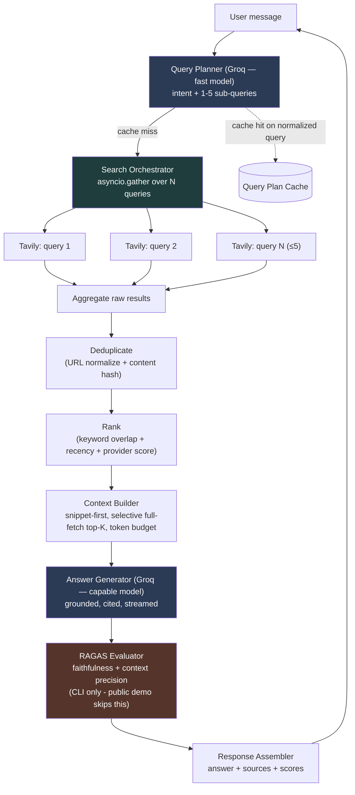

# AI Search Chatbot — Architecture

**Provider:** Tavily (search) · Groq (LLM) · RAGAS (evaluation)
**Interface:** interactive CLI (`presentation/cli.py`) and a public Streamlit
demo (`presentation/streamlit_app.py`), both thin adapters over the same
`ChatPipeline` - no pipeline logic duplicated in either. A FastAPI layer
remains a documented future option, not built.

Related docs: [Decisions & tradeoffs](decisions.md) · [Roadmap & checklist](roadmap.md) · [Phase build logs](phases/)

---

## 1. Objective, restated as an engineering problem

A user asks a natural-language research question. The system must turn that into
1–5 targeted search queries, run them concurrently against a single search
provider, merge and rank what comes back, compress it into a small grounded
context, ask Groq to answer *only* from that context, score the answer with
RAGAS, and return the answer plus its sources. Every stage is a swappable
component behind an interface, because the internship deliverable is judged as
much on architecture as on the demo.

Two competing pressures shape every decision in [decisions.md](decisions.md):
**accuracy** (ground the answer, avoid hallucination) vs. **latency/tokens**
(this is an interactive chatbot — a 15-second wait per turn kills the
"interactive" claim in the brief). Where a design decision trades one for the
other, that tradeoff is called out explicitly.

---

## 2. End-to-end pipeline



Two Groq calls per turn (planner, generator), one Tavily fan-out, one RAGAS
pass on the CLI path only (itself 1-2 Groq calls as judge - `answer_relevancy`
was dropped, Decision 8.2, since Groq serves no embeddings model). That's the
entire cost surface — every optimization in [decisions.md](decisions.md) is
about shrinking or parallelizing those calls.

Phase 15 added an optional `conversation` parameter to `QueryPlanner.plan()`
(not pictured above, to keep this diagram at pipeline-stage granularity): a
bounded window of recent turns gets folded into the same planning prompt so a
follow-up question resolves references like "which one" or "its" - see the
README's [Conversation-Aware Follow-ups](../README.md#conversation-aware-follow-ups)
section for that diagram, and [`docs/phases/phase15.md`](phases/phase15.md)
for the live-verified walkthrough.

---

## 3. Clean-architecture layering

The brief asks for SOLID + loose coupling, so the codebase is organized by
**dependency direction**, not by feature. Inner layers never import outer
layers.

| Layer | Contains | Depends on |
|---|---|---|
| **Domain** | Entities (`Query`, `SearchResult`, `Source`, `Answer`, `EvaluationResult`, `ConversationTurn`, `ConversationContext`) and interfaces/ports (`SearchProvider`, `LLMProvider`, `Ranker`, `Evaluator`, `ContentExtractor`, `Cache`) | Nothing |
| **Application** | Use-case orchestration: `QueryPlanner`, `SearchOrchestrator`, `Deduplicator`, `HeuristicRanker`, `ContextBuilder`, `AnswerGenerator`, `EvaluationService`, `ChatPipeline` | Domain only (interfaces, not concrete classes) |
| **Infrastructure** | Concrete adapters: `TavilyProvider`, `GroqClient`, `RagasEvaluator`, `NullEvaluator`, `InMemoryCache`, `TrafilaturaContentExtractor` | Domain (implements the ports) |
| **Presentation** | `cli.py` (chat loop), `streamlit_app.py` (public demo), `conversation_context.py` (windows session state into a `ConversationContext`) | Application |

This is why Serper can later replace Tavily by adding one file and one config
line — nothing in `application/` or `presentation/` ever imports
`infrastructure.search.tavily_provider` directly; it depends on the
`SearchProvider` abstract class and receives a concrete instance via
constructor injection from a small composition root (`bootstrap.py`).

---

## 4. Folder structure

As actually built (Phases 0–15). See the root
[README](../README.md#project-structure) for the always-current version with
one-line descriptions per file; this tree adds brief design-rationale notes
instead.

```
ai-search-chatbot/
├── src/
│   ├── domain/
│   │   ├── entities.py              # Query, SearchResult, Source, Answer, EvaluationResult, ConversationTurn, ConversationContext
│   │   ├── interfaces.py            # SearchProvider, LLMProvider, Ranker, Evaluator, ContentExtractor, Cache (ABCs)
│   │   └── exceptions.py            # PipelineError + SearchProviderError, LLMGenerationError, EvaluationError - one per port, so no adapter's raw SDK exception ever leaks past its boundary
│   │
│   ├── application/
│   │   ├── query_planner.py         # decides intent + generates 1-5 queries; optional `conversation` param (Phase 15) resolves follow-up references in the same Groq call, no second LLM call
│   │   ├── search_orchestrator.py   # parallel fan-out over SearchProvider
│   │   ├── deduplicator.py
│   │   ├── ranker.py                # HeuristicRanker: default implementation of Ranker
│   │   ├── context_builder.py       # snippet-first + token budgeting
│   │   ├── answer_generator.py      # grounded prompt -> Groq -> Answer, generate() and generate_streaming()
│   │   ├── evaluation_service.py    # non-blocking wrapper around Evaluator: timeout + catch, always returns an EvaluationResult
│   │   └── pipeline.py              # ChatPipeline: wires the above into one call; handle() + handle_streaming(), always returns an Answer, never raises
│   │
│   ├── infrastructure/
│   │   ├── search/
│   │   │   └── tavily_provider.py   # implements SearchProvider (a second provider would be a sibling file, same shape)
│   │   ├── llm/
│   │   │   └── groq_client.py       # implements LLMProvider, model-tiered (fast model for planning, capable model for generation)
│   │   ├── evaluation/
│   │   │   ├── ragas_evaluator.py   # implements Evaluator via RAGAS + instructor + Groq-as-judge
│   │   │   └── null_evaluator.py    # no-op Evaluator: instant EvaluationResult(), no I/O - what the public demo wires instead, to protect shared free-tier quota
│   │   └── content/
│   │       └── content_extractor.py # TrafilaturaContentExtractor implements ContentExtractor
│   │
│   ├── config/
│   │   ├── settings.py              # pydantic-settings, reads .env
│   │   └── prompts/
│   │       ├── query_planner.txt       # plain text, not embedded in Python - edit the prompt without touching code
│   │       ├── query_planning.py       # loads the .txt + QueryPlanResponse schema
│   │       ├── answer_generation.txt
│   │       └── answer_generation.py
│   │
│   ├── presentation/
│   │   ├── cli.py                   # interactive streaming chat loop; real RagasEvaluator via build_chat_pipeline()
│   │   ├── streamlit_app.py         # public demo chat UI; NullEvaluator via build_demo_pipeline(), fresh pipeline per turn (Decision 14.3)
│   │   └── conversation_context.py  # builds a windowed ConversationContext from session state; split out of streamlit_app.py specifically so it's unit-testable
│   │
│   ├── utils/
│   │   ├── logging.py               # structured logging with per-turn correlation IDs
│   │   └── token_counter.py         # char-based heuristic, not tiktoken (Decision 0.x - a 15.5s first-use cost ruled tiktoken out)
│   │
│   └── bootstrap.py                 # composition root: build_chat_pipeline() (real RagasEvaluator) and build_demo_pipeline() (NullEvaluator) share everything else
│
├── tests/
│   ├── unit/                        # one test module per application/ file, providers mocked, no network
│   └── integration/                 # real Tavily/Groq/RAGAS calls, gated behind RUN_INTEGRATION_TESTS=1
│
├── .env.example
├── pyproject.toml
├── requirements.txt                 # Streamlit Cloud's install step; deliberately excludes ragas and its dependency tree
└── README.md
```

**Not built, and no longer planned as originally scoped:** a shared
`utils/retry.py` wrapper (each adapter builds its own `tenacity.AsyncRetrying`
instead, parameterized by `Settings` - a shared decorator would have blurred
the fact that Tavily and Groq don't fail the same way) and a `RedisCache`
(the in-memory cache's "single-process dev default" scope was never
outgrown). `presentation/api.py` (FastAPI) remains a documented future option
- see `docs/roadmap.md`'s "Future work" note - not a gap in what shipped.

---

## 5. Component responsibilities and why each exists

| Component | Responsibility | Why it's a separate component |
|---|---|---|
| **QueryPlanner** | Single Groq call: classify intent + emit 1–5 sub-queries as structured JSON. Since Phase 15, an optional `conversation` parameter resolves a follow-up's pronouns/references against a bounded recent window in this same call | Isolates the only place that decides "how many searches" - and, since it already decides what the user wants, the natural place to also resolve what they mean by "which one." |
| **SearchOrchestrator** | Fans sub-queries out concurrently to one `SearchProvider`, applies per-query timeout, tolerates partial failure | Concurrency and resilience logic lives once, not duplicated per provider. |
| **SearchProvider (port)** | `async def search(query, max_results) -> list[SearchResult]` | Tavily today - zero changes above this line if a second provider were ever added. |
| **Deduplicator** | Removes same-URL and near-duplicate-content results across all sub-query result sets | Sub-queries *will* overlap ("best CE colleges Pune" + "top engineering colleges Pune ranking" return the same JEE-counsellor articles) — without this step the ranker sees inflated relevance for duplicated domains. |
| **Ranker (port + default impl)** | Scores and orders the deduplicated set | Kept behind an interface so a heuristic scorer today can become an embedding/cross-encoder reranker later without touching the pipeline. |
| **ContextBuilder** | Picks top-K sources, decides snippet-vs-full-content per source, enforces a token budget | This is the accuracy/token tradeoff's home. One component owns "how much do we show the LLM," so token limits are tuned in one place. |
| **ContentExtractor** | Fetches and cleans full page HTML for the (few) sources where snippet is judged insufficient | Kept separate from ContextBuilder so it can be skipped, cached, or swapped (readability vs. trafilatura) independently. |
| **AnswerGenerator** | Builds the grounded prompt, calls Groq's capable model (all-at-once or streamed), parses citations | The only component allowed to produce user-facing prose — keeps grounding rules (cite-or-refuse) enforced in exactly one prompt. |
| **EvaluationService** | Non-blocking wrapper: timeout + catch around an `Evaluator`, always returns an `EvaluationResult` | Isolated because RAGAS has its own LLM-judge cost and failure modes; it must never be able to block or corrupt answer delivery. |
| **Evaluator (port), RagasEvaluator / NullEvaluator (impls)** | Reference-free answer scoring against (question, answer, contexts) | Two implementations in production, not hypothetical: the CLI wires the real `RagasEvaluator`, the public demo wires `NullEvaluator` (instant, no I/O) to protect shared Groq free-tier quota on a public surface - a one-line composition-root difference, zero pipeline logic duplicated. |
| **ChatPipeline** | Orchestrates the above via `handle()`/`handle_streaming()`, owns cross-cutting concerns (timing, logging, the graceful-degradation ladder) - always returns an `Answer`, never raises | The single "use case" object — `presentation/cli.py` and `presentation/streamlit_app.py` both call this, so neither duplicates orchestration logic. |
| **Cache (port), InMemoryCache (impl)** | Get/set with TTL | One interface so a future persistent cache is a `bootstrap.py` change, not a pipeline change - never outgrew the in-memory dev default in practice. |
| **ConversationContext / ConversationTurn** | Plain data: a bounded window of recent (question, truncated-answer) pairs | Built by the presentation layer (`conversation_context.py`) from its own session state and passed into `ChatPipeline` as optional data - domain/application code stays presentation-agnostic, same as every other entity here. |
